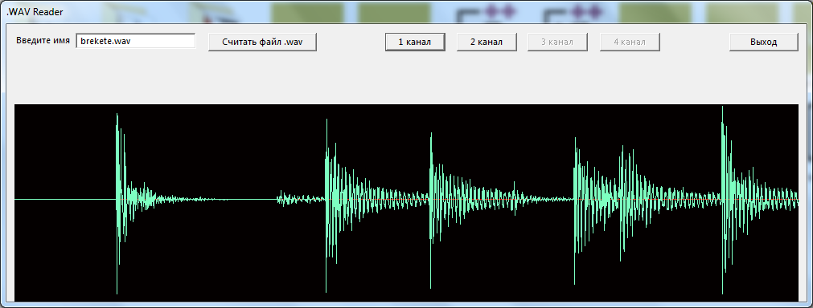
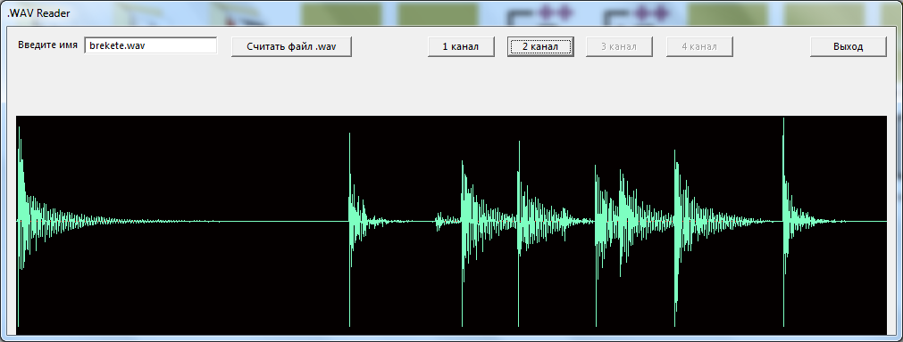
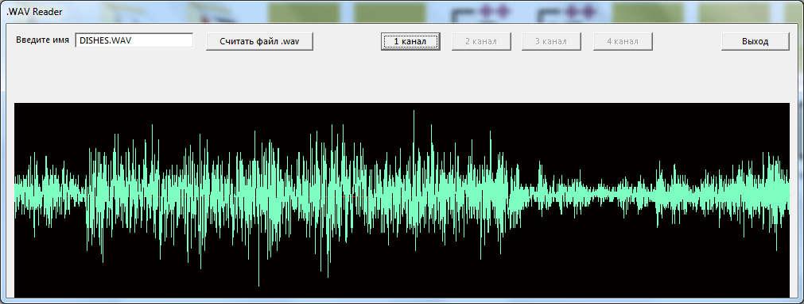

# wavViewer
визуализация звуковой дорожки аудиофайла

### Особенности:
- чтение нескольких каналов
- визуализация (отображение и zoom) дорожки реализована без использования библиотеки MFC

### Примеры:

<h4 align="center">
  
</h4>

<h4 align="center">
  
</h4>

<h4 align="center">
  
</h4>
